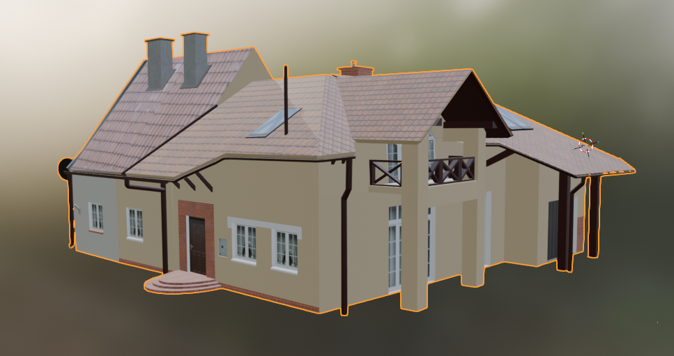
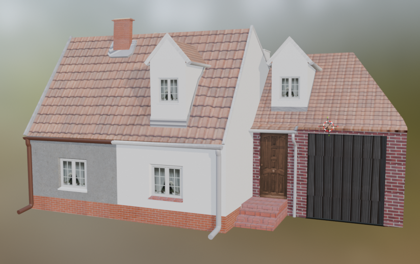
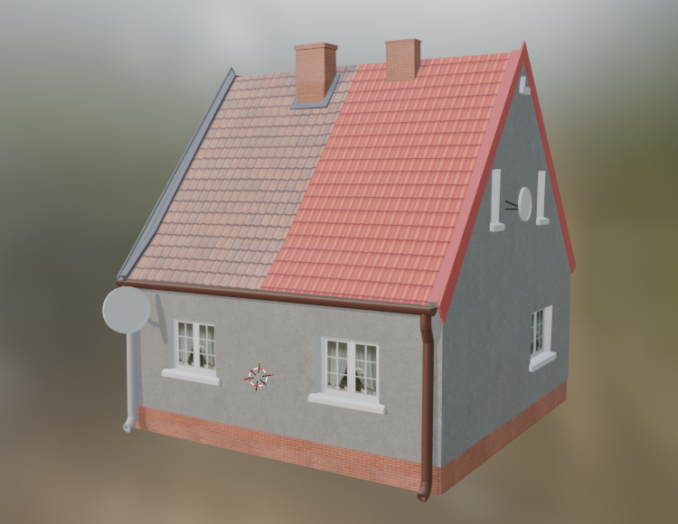
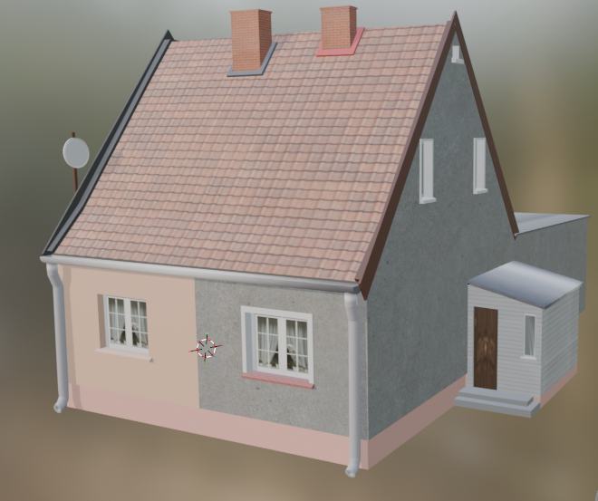
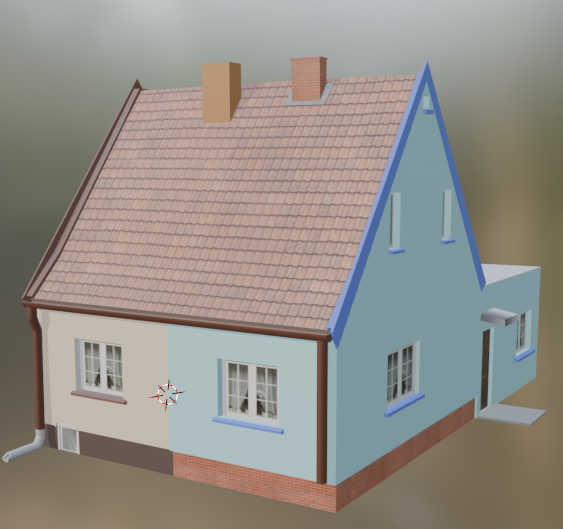
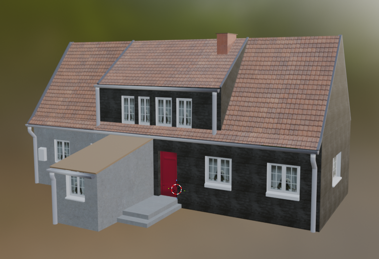
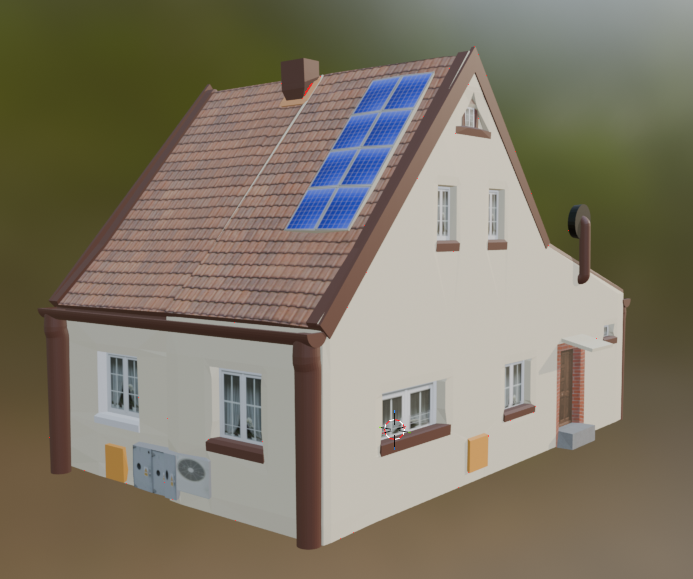

# 🏘️ Budynki z ul. Suwalskiej w Elblągu – Modele 3D w Blenderze

> Projekt wizualizacji architektonicznych budynków mieszkalnych przy ulicy Suwalskiej w Elblągu, wykonanych w programie **Blender**.

---

## 📋 Opis projektu

Projekt obejmuje szczegółowe modele 3D budynków jednorodzinnych zlokalizowanych przy **ul. Suwalskiej w Elblągu**. Każdy model został stworzony z dbałością o odwzorowanie rzeczywistej architektury – od pokrycia dachowego, przez elewację, aż po detale takie jak okna, drzwi, rynny czy kominy.

Modele wykonano w **Blenderze** z wykorzystaniem tekstur fotograficznych oraz materiałów proceduralnych. Projekt może służyć jako dokumentacja architektoniczna, materiał edukacyjny lub baza do dalszych wizualizacji.

---

## 🏗️ Modele budynków

### Suwalska 6/8


Budynek jednorodzinny z czerwoną dachówką ceramiczną. Elewacja ceglana z elementami tynkowanymi. Widoczny garaż z ciemnymi wrotami oraz wejście główne z drewnianymi drzwiami.

---

### Suwalska 14/16


Parterowy budynek z lukarnami dachowymi. Tynkowana elewacja w bieli z ceglanym cokołem. Model zawiera szczegółowe odwzorowanie okien, rynien oraz drzwi wejściowych.

---

### Suwalska 15/13


Budynek dwukondygnacyjny z dachem dwuspadowym. Elewacja w szarej tonacji z ceglanym pasem przy podstawie. Dach pokryty dachówką w kolorze terakoty – jedna połać z materiałem docelowym, druga pokazuje stan roboczy projektu.

---

### Suwalska 17/19


Budynek z charakterystyczną różowo-szarą elewacją dwubarwną. Dach dwuspadowy z dachówką ceramiczną. Model zawiera antenę satelitarną, wejście boczne z wiatą oraz szczegółowe odwzorowanie stolarki okiennej.

---

### Suwalska 27/25


Budynek z jasną elewacją i niebieskim akcentem na szczycie. Dach pokryty dachówką ceramiczną z kominami. Model posiada dobudówkę boczną oraz szczegóły elewacji z ceglanym cokołem.

---

### Suwalska 34/33


Rozbudowany budynek wielofunkcyjny z ciemną elewacją (kolor antracyt/czarny). Charakterystyczne czerwone drzwi wejściowe. Model zawiera zadaszony podjazd oraz duże okna na poddaszu użytkowym.

---

### Suwalska 46/48


Budynek z jasną tynkowaną elewacją i dachem pokrytym dachówką ceramiczną. Model zawiera instalację fotowoltaiczną na dachu, pompę ciepła przy elewacji, ceglane detale dekoracyjne oraz bogatą stolarkę okienną i drzwiową.

---

## 🛠️ Technologie i narzędzia

| Narzędzie | Wersja / Opis |
|-----------|---------------|
| **Blender** | Modelowanie, teksturowanie, rendering |
| **Cycles / EEVEE** | Silnik renderowania |
| Tekstury fotograficzne | `.jpg`, `.png` – dachówki, cegła, tynk, drewno |
| Formaty plików | `.blend`, `.blend1`, `.fbx` |

---

## 📁 Struktura projektu

```
📦 projekt/
├── 📂 Photos/                    # Zdjęcia renderów wszystkich budynków
│   ├── Suwalska_6__8.png
│   ├── Suwalska_14__16.png
│   ├── Suwalska_15__13.png
│   ├── Suwalska_17__19.png
│   ├── Suwalska_27__25.png
│   ├── Suwalska_34__33.png
│   └── Suwalska_46__48.png
├── Suwalska 6, 8.blend           # Plik główny modelu
├── Suwalska 6, 8.blend1          # Kopia zapasowa
├── Suwalska 14, 16.blend
├── Suwalska 14, 16.blend1
├── Suwalska 14, 16.fbx           # Eksport do FBX
├── Suwalska 15, 13.blend
├── Suwalska 15, 13.blend1
├── Suwalska 17, 19.blend
├── Suwalska 17, 19.blend1
├── Suwalska 27, 25.blend
├── Suwalska 27, 25.blend1
├── Suwalska 34, 33.blend
├── Suwalska 34, 33.blend1
├── Suwalska 46, 48.blend
├── Suwalska 46, 48.blend1
├── Suwalska 46, 48.fbx
└── 📂 Tekstury/                  # Zasoby graficzne
    ├── b_dachowki_ceramiczne_czerwone_01_8m.png
    ├── b_sc_beton_01_4m.png
    ├── b_sc_cegly_czerwone_klinkier_01_4m.png
    ├── biale_panele.jpg
    ├── blacha_dach.jpg
    ├── cegly.png
    ├── dachowa1.jpg / dachowa2.jpg
    ├── okno.png / okno.jpg / okno_dach.png
    ├── drzwi_gora.png / drzwi_bok.png / drzwi_taras.png
    ├── reddoor.jpg
    ├── papa.jpg
    ├── plytki.png
    ├── szare_deski.jpg
    ├── wall-texture.jpg
    ├── yellow-concrete-textured-background.jpg
    └── ...oraz inne
```

---

## 🚀 Jak otworzyć projekt

1. Zainstaluj [Blender](https://www.blender.org/download/) (zalecana wersja 3.x lub nowsza).
2. Sklonuj lub pobierz repozytorium:
   ```bash
   git clone https://github.com/TWOJ_LOGIN/NAZWA_REPO.git
   ```
3. Otwórz wybrany plik `.blend` w Blenderze:
   - `File` → `Open` → wybierz plik `.blend`
4. Tekstury powinny być automatycznie wykryte, jeśli zachowana jest struktura katalogów. W razie problemów użyj `File` → `External Data` → `Find Missing Files`.

---

## 👤 Autor

**Adrian Witów**

---

## 📄 Licencja

Projekt stworzony w celach dokumentacyjnych i edukacyjnych. Wszelkie prawa zastrzeżone © Adrian Witów.
